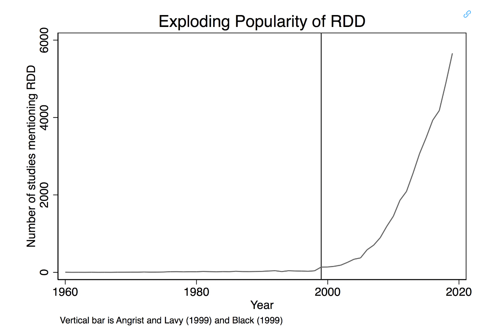
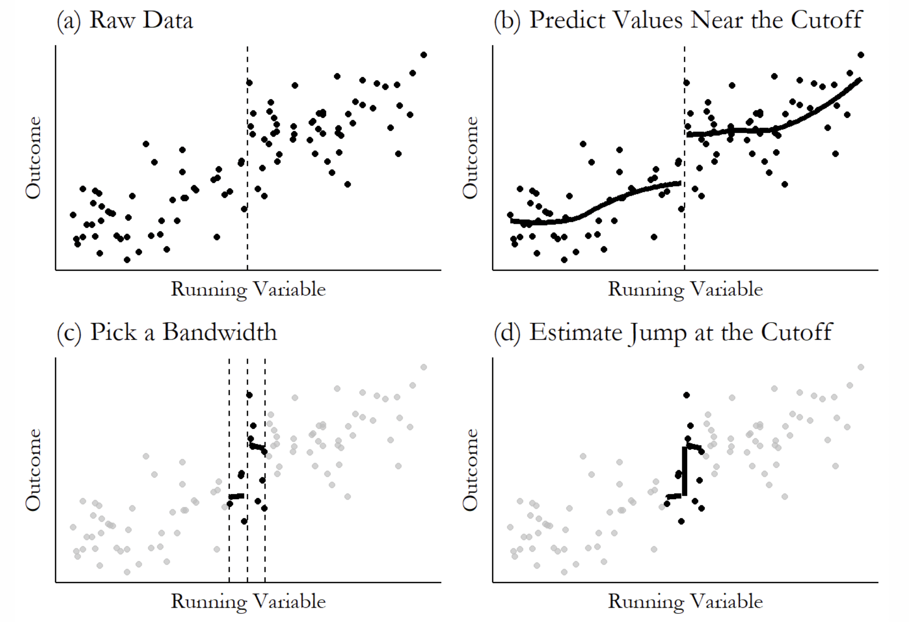
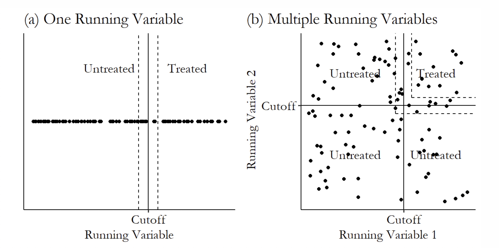

```{r setup, include=FALSE}
knitr::opts_chunk$set(echo = TRUE)
```

## Regression Discontinuity Design (RDD)

- RDD focuses on a treatment at a cutoff point, looking just to either side of the cutoff. One side with the treatment and the other without. 

- "Nature does not make jumps" -Charles Darwin

## Key Terms

- Running variable: Variable that determines whether or not you are treated

- Cutoff: The value of the running variable that determines treatment or not

- Bandwith: Distance from cutoff value we're willing to look at

## Causal Inference: The Mixtape, By: Scott Cunningham
History

- The first time RDD appears in the economics community is with an unpublished econometrics paper (Goldberger 1972)

<p style="text-align: center;">
  
</p>

## Data Requirements

- "The validity of an RDD doesn’t require that the assignment rule be arbitrary. It only requires that it be known, precise and free of manipulation."

- "Hair Trigger" Ex: DWI (BAC %.08), Medicare (65)

- Need large amounts of data

- Relationships to get this data

## Inference

- Common practice to estimate causal effects using local polynomial regressions

- Window too large results in issues

- In a 2008 paper Lee and Card suggested that researchers should cluster their standard errors by the running variable
- "Kolesár and Rothe (2018) provide extensive theoretical and simulation-based evidence that clustering on the running variable is perhaps one of the worst approaches you could take"

## Inference

- 2 Confidence Interval Approach

- "Honest" Intervals- Uniform coverage over all conditional expectation functions in large samples

- Can be implemented using RDHonest Package

## The Effect: An Introduction to Research Causality and Design, By: Nick Huntington-Klein

<p style="text-align: center;">
  
</p>

## Multiple Cutoffs?

- Different cutoffs depending on individual identifiers (Ex:Admission standards for athletes, GED score requirement varies state to state)

- One cutoff that changes over time 
      Bana, Bedard, and Rossin-Slater (2020)
      Quarterly income to max out family leave payments increased from $20,000 to $25,000 between       2005 and 2014

## Multiple Cutoffs?

- Center Data (Bana, Bedard, and Rossin-Slater (2020)   
    Results in weighted average of local effects based on number of observations around respective     cutoffs

- rdmulti

- rdms specifically- different cutoffs of the same running variable give different kinds or levels of treatment (ex: dosages of medicine)

## Two Running Variables

<p style="text-align: center;">
  
</p>

Ex: Geography (longitude and latidue), Education (requirements in two subjects to advance)

## Sources

https://mixtape.scunning.com/06-regression_discontinuity
https://theeffectbook.net/ch-RegressionDiscontinuity.html
ChatGPT
